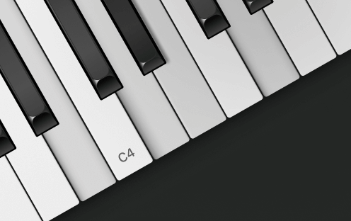

<div align="center">
  
</div>

<div align="center">
  <h1>Klavier</h1>
  <h3>A lightweight, customizable, interactive piano library built with React.</h3>
</div>

## Features

* Small - 4kB gzipped
* Fully customizable
* Keyboard, mouse, and touch support
* Supports both [controlled and uncontrolled mode](https://react.dev/learn/sharing-state-between-components#controlled-and-uncontrolled-components)

## Getting started

```
npm install klavier
```

```tsx
import React from 'React'
import { Klavier } from 'klavier';

const App = () => {
  return <Klavier /> // render a default 88-key keyboard
}
```

## Props

| Prop                  | Default value    | Description                                                  |
|-----------------------|------------------|--------------------------------------------------------------|
| `noteRange`           | `[21, 107]`      | The lowest and the highest notes of the piano in MIDI numbers (0-127). |
| `defaultActiveNotes`  | `[]`             | Notes that are pressed by default. Subsequent updates are ignored. Cleared when the user begins playing. |
| `activeNotes`         |                  | Currently pressed notes. Puts component into controlled mode; active notes must be managed externally via callbacks. |
| `onPlayNote`          |                  | Fired when a note is played.                                 |
| `onStopNote`          |                  | Fired when a note is stopped.                                |
| `onChange`            |                  | Fired when active notes are changed via user input.          |
| `interactive`         | `true`           | Enable interaction with the piano via keyboard, mouse, or touch. |
| `keymap`              | `DEFAULT_KEYMAP` | Mapping of computer keys to MIDI note numbers, e.g. `[{ key: 'q', midiNumber: 60 }, ..., { key: 'i', midiNumber: 72 }]` |
| `width`               | `"auto"`         | Width of the piano. Accepts any valid CSS value. When unspecified, the piano fills it's container and is responsive. |
| `height`              | `"auto"`         | Height of the piano. Accepts any valid CSS value.            |
| `whiteKeyAspectRatio` | `"23 / 150"`     | Aspect ratio of the white key in CSS format. Ignored when `height` is specified. |
| `blackKeyHeight`      | `"67.5%"`        | Height of the black key. Allows tweaking the appearance of black keys in relation to white keys. |
| `components`          |                  | Allows replacing default components for black and white keys.  |


## Styling

### Layout
By default, Klavier is responsive takes up the full width of its parent container. This can be changed by using a combination of `width`, `height`, `whiteKeyAspectRatio` and `blackKeyHeight` props. 

### Appearance
The visual appearance of the keyboard can be customized by specifying custom components for the black and white keys. This enables styling the keyboard with any approach.

```tsx
const CustomBlackKey = ({ ...props }) => { return <div {…props} /> }
const CustomWhiteKey = ({ ...props }) => { return <div {…props} /> }

<Klavier components={{ blackKey: CustomBlackKey, whiteKey: CustomWhiteKey }} />
```

Provided `props` must be spread onto custom component's root element to preserve the library's functionality. <br/>
**Important:** avoid defining components directly in the prop object, as it can cause performance issues.
